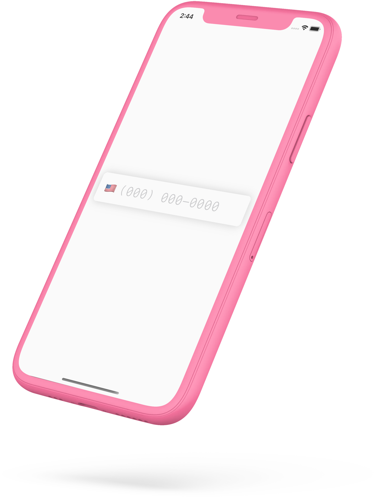

<h1 align="center"> iPhoneNumberField ☎️</p>
<h3 align="center">Format phone numbers as they're typed—entirely in <span style="text-decoration: underline;">SwiftUI</span>. 📱</h3>
<!-- <p align="center">(entirely in SwiftUI!)</p>
 -->
<p align="center">
    <strong><a href="#get-started">Get Started</a></strong> |
    <strong><a href="#examples">Examples</a></strong> |
    <strong><a href="#customize">Customize</a></strong> |
    <strong><a href="#features">Features</a></strong> |
    <strong><a href="#install">Install</a></strong> |
    <strong><a href="#pricing">Pricing</a></strong>
</p>

<p align="center">
    
</p>

<br />

## And it's as easy as
```swift
iPhoneNumberField("Phone", text: $text)
```


<p align="center">
    
</p>


## Get Started

1. [Install](./INSTALL.md) `iPhoneNumberField`.

2. Add `iPhoneNumberField` to your project.
```swift
import SwiftUI
import iPhoneNumberField

struct ContentView: View {
    @State var text = ""

    var body: some View {
        iPhoneNumberField("Phone", text: $text)
    }
}
```

3. Customize your `iPhoneNumberField`


## Examples
### Flags 🇦🇶


Show the flag, and make it selectable, so your users can find their region.

```swift
import SwiftUI
import iPhoneNumberField

struct ContentView: View {
    @State var text = ""

    var body: some View {
        iPhoneNumberField(text: $text)
            .flagHidden(false)
            .flagSelectable(true)
            .font(UIFont(size: 30, weight: .bold, design: .rounded))
            .padding()
    }
}
```

<br clear="right"/>
<br/>

<h3 align="left">Focus and unfocus 🔍</h3>
<p align="left">Use iPhoneNumberField's optional binding and programmatically change the text field.</p>


```swift
import SwiftUI
import iTextField
import iPhoneNumberField

struct ContentView: View {
    @State var nameText = ""
    @State var phoneText = ""
    @State var phoneEditing = false

    var body: some View {
        VStack {
            TextField("Name", text: $nameText)
                .padding()
            iPhoneNumberField("Phone", text: $phoneText, isEditing: $phoneEditing)
                .font(UIFont(size: 24, weight: .light, design: .monospaced))
                .padding()
        }
    }
}
```

<br clear="left"/>
<br/>
<br/>

### Custom style 🎀


Use our modifiers to create a fully customized field.

```swift
import SwiftUI
import iPhoneNumberField

struct ContentView: View {
    @State var text: String = ""
    @State var isEditing: Bool = false

    var body: some View {
        iPhoneNumberField("(000) 000-0000", text: $text, isEditing: $isEditing)
            .flagHidden(false)
            .flagSelectable(true)
            .font(UIFont(size: 30, weight: .light, design: .monospaced))
            .maximumDigits(10)
            .foregroundColor(Color.pink)
            .clearButtonMode(.whileEditing)
            .onClear { _ in isEditing.toggle() }
            .accentColor(Color.orange)
            .padding()
            .background(Color.white)
            .cornerRadius(10)
            .shadow(color: isEditing ? .lightGray : .white, radius: 10)
            .padding()
    }
}
```

<br clear="right"/>
<br/>
<br/>

## Customize
`iPhoneNumberField` takes 2 required parameters: 1️⃣ a `String` placeholder, and 2️⃣ a binding to a phone number string. All customizations are built into our modifiers.

**Example**: Customize the text field style, and call a closure when editing ends.
```swift
iPhoneNumberField("", text: $text)
	.accentColor(Color.green)
	.clearsOnBeginEditing(true)
	.clearButtonMode(.always)
	.onEditingEnded { print("DONE ✅") }
```
Use our exhaustive input list to customize your view.

<div align="center">

| | Modifier | Description
--- | --- | ---
🔠 | `.font(_:)` | Modifies the text field’s **font** from a `UIFont` object.
🎨 | `.foregroundColor(_:)` | Modifies the **text color**  of the text field.
🖍 | `.accentColor(_:)` | Modifies the **cursor color**  while typing on the text field.
🌈 | `.placeholderColor(_:)` | Modifies the <i>entire</i> **placeholder color** of the text field.
🖍 | `.numberPlaceholderColor(_:)` | Modifies <i>solely</i> the **phone number placeholder color** of the text field – without the country code.
🐠 | `.countryCodePlaceholderColor(_:)` | Modifies <i>solely</i> the **country code placeholder color** of the text field – without the phone number.
↔️ | `.multilineTextAlignment(_:)` | Modifies the **text alignment** of a text field.
☎️ | `.textContentType(_:)` | Modifies the **content type** of a text field for implied formatting. 
▶️ | `.clearsOnEditingBegan(_:)` | Modifies the **clear-on-begin-editing** setting of a  text field.
👆 | `.clearsOnInsert(_:)` | Modifies the **clear-on-insertion** setting of a text field.
❌ | `.clearButtonMode(_:)` | Modifies whether and when the text field **clear button** appears on the view.
☑️ | `.textFieldStyle(_:)` | Modifies the style of the text field to one of Apple's three pre-designed styles.
🔟 | `.maximumDigits(_:)` | Modifies the maximum number of digits the text field allows.
🇦🇶 | `.flagHidden(_:)` | Modifies whether the text field hides the country flag on the left 🇸🇪🇹🇼🇨🇬.
🇸🇮 | `.flagSelectable(_:)` | Modifies whether the flag is selectable.
➕ | `.prefixHidden(_:)` | Modifies whether the country code prefix should be hidden. Note: prefix will only be shown if using the default placeholder (`placeholder = nil`). 
📞 | `.formatted(_:)` | Modifies whether the binding you pass as the `text` parameter gets formatted.
✋ | `.disabled(_:)` | Modifies whether the text field is **disabled**.
▶️ | `.onEditingBegan(perform: { code })` | Modifies the function called when text editing **begins**.
💬 | `.onNumberChange(perform: { code })` | Modifies the function called when the user makes any **changes** to the text in the text field.
💬 | `.onEdit(perform: { code })` | Modifies the function called when the user makes any **changes** to the text in the text field.
🔚 | `.onEditingEnded(perform: ({ code })` | Modifies the function called when text editing **ends**.
🔘 | `.onClear(perform: { code })` | Modifies the function called when the user clears the text field.
↪️ | `.onReturn(perfom: { code })` | Modifies the function called when the user presses return.
🏳️| `.defaultRegion(_:)` | Receives a country string and selects the default phone format.
</div>

##  Features

<div align="center">

| |Features |
--------------------------|------------------------------------------------------------
:phone: | Validate, normalize and extract the elements of any phone number string.
:checkered_flag: | Fast. 1000 parses -> ~0.4 seconds.
:books: | Best-in-class metadata from Google's libPhoneNumber project.
:trophy: | Fully tested to match the accuracy of Google's JavaScript implementation of libPhoneNumber.
:iphone: | Built for iOS. Automatically grabs the default region code from the phone.
📝 | Editable (!) AsYouType formatter for UITextField.
:us: | Convert country codes to country names and vice versa
⚙️ | Access to all native `UITextField` configurations
🔍 | Searchable and customizable country code and name list
∞ | Many more features to discover

</div>


## Install

You can use the Swift package manager to install `iPhoneNumberField`. Find Xcode SPM instructions [here](./INSTALL.md)

```
dependencies: [
    .package(url: "https://github.com/MojtabaHs/iPhoneNumberField.git", .upToNextMinor(from: "0.10.0"))
]
```

# 🌟 Become a Paid Subscriber
This library is under the **MIT** license and completely **FREE**. Anyone can use it anywhere, and any contribution is welcome.

In addition, you can show your support and [become My sponsor](https://www.buymeacoffee.com/mojtabahs/membership).
By supporting me, you will gain¹:
- Tickets for code-level support in any project you want (not just this one)
- Access me through my socials and we can discuss technologies together.
- Discounts and early access to my premium products.
- Early access to updates and bug fixes.
- We can even discuss your project entirely and build it together 💪🏻.

Remember that it is my pleasure to be a part of the community and try my best to deliver my experience to anyone who needs it.

<sub>¹ Paid program options are related to the chosen level.</sub>
